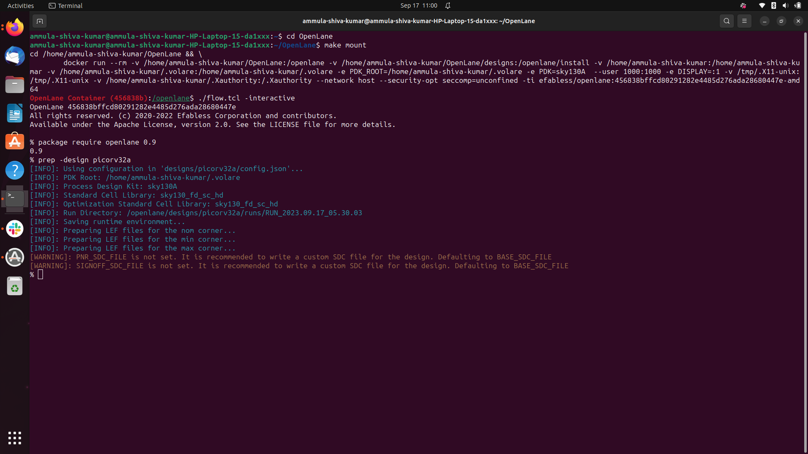
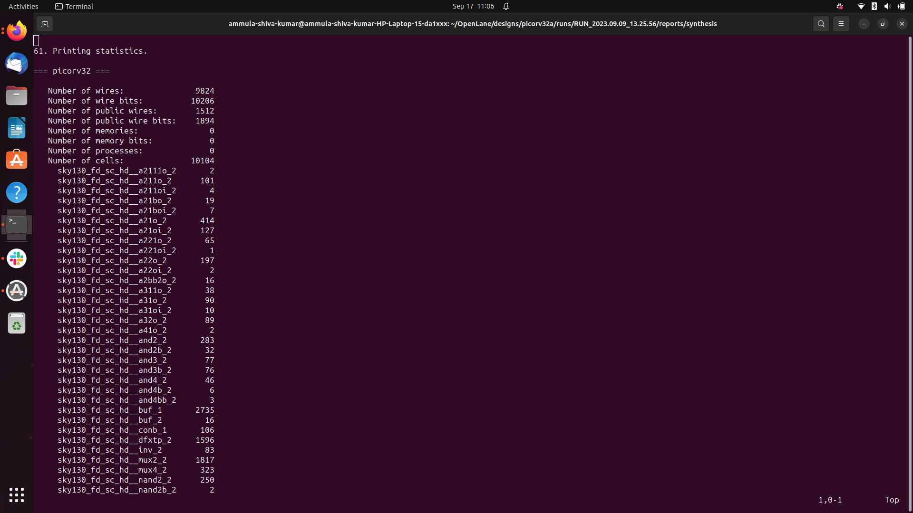
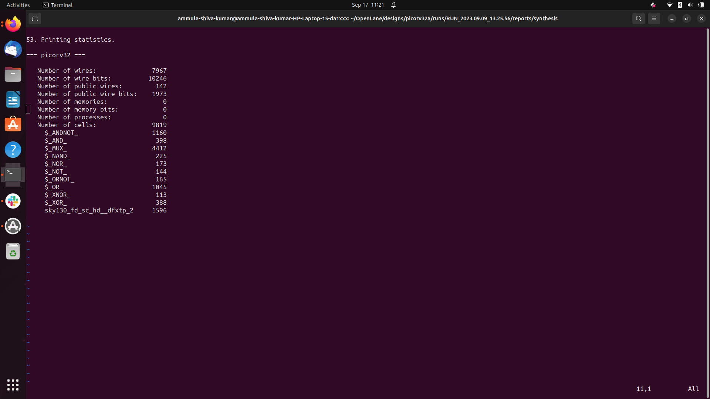
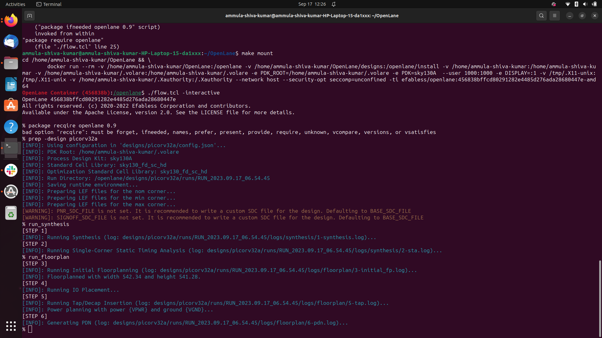
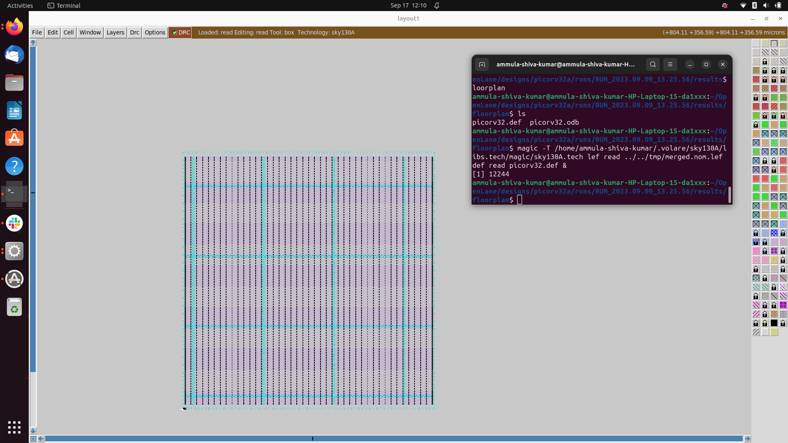
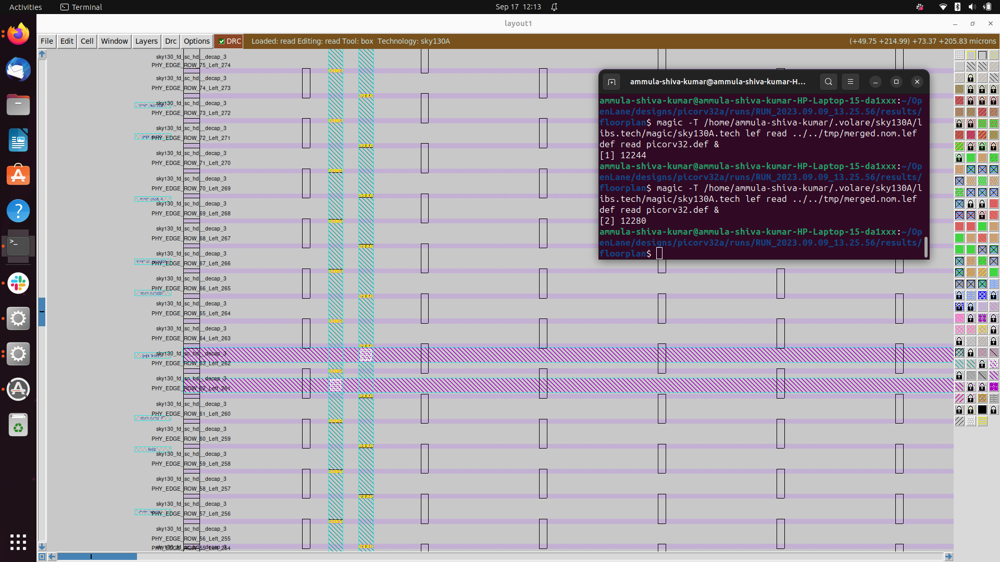
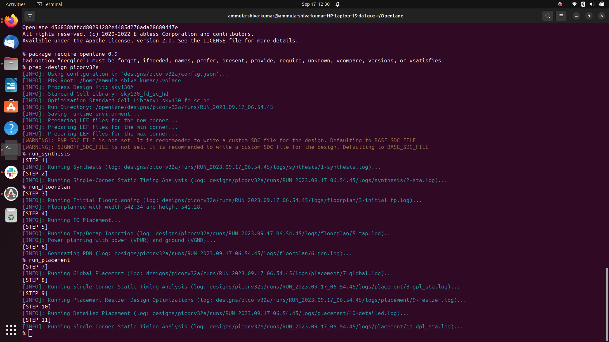
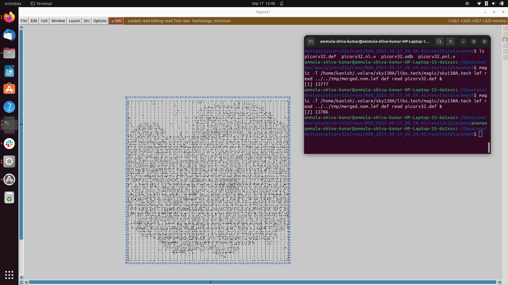

# Physical-Design-Using-OpenLane

This project is done in the course ["Advanced Physical Design using OpenLANE/Sky130"](https://www.vlsisystemdesign.com/advanced-physical-design-using-openlane-sky130/) by VLSI System Design Corporation. In this project a complete RTL to GDSII flow for PicoRV32a SoC is executed with Openlane using Skywater130nm PDK. Custom designed standard cells with Sky130 PDK are also used in the flow. Timing Optimisations are carried out. Slack violations are removed. DRC is verified.


## Table of Contents
- [Day - 1 Inception of Open-Source EDA, OpenLane and Sky130 PDK](#day---1-inception-of-open-source-eda-openlane-and-sky130-pdk)
  * [Overview](#overview)
  * [Inception of Opensource EDA](#inception-of-opensource-eda)
      + [SOC Design & OpenLANE](#soc-design--openlane)
          + [Components of opensource digital ASIC design](#components-of-opensource-digital-asic-design)
          + [Simplified RTL2GDS Flow](#simplified-rtl2gds-flow)
          + [OpenLANE ASIC Flow](#openlane-asic-flow)
      + [Opensource EDA tools](#opensource-eda-tools)
          + [OpenLANE design stages](#openlane-design-stages)
          +  [OpenLANE Files](#openlane-files)
          +  [Invoking OpenLANE](#invoking-openlane)
          +  [Design Preparation Step](#design-preparation-step)
          +  [Review of files & Synthesis step](#design-preparation-step#review-of-files-&-synthesis-step)
- [Day - 2 Floorplanning & Placement and library cells](#Day---2-Floorplanning-&-Placement-and-library-cells)
  * [Utilization factor and Aspect ratio](#Utilization-factor-and-Aspect-ratio)
     + [Floorplanning considerations](#floorplanning-considerations)
        +  [Utilization Factor & Aspect Ratio](#utilization-factor--aspect-ratio)
        +  [Pre-placed cells](#pre-placed-cells)
        +  [Decoupling capacitors](#decoupling-capacitors)
        +  [Power Planning](#power-planning)
        +  [Pin Placement](#pin-placement)
  * [Floorplan run on OpenLANE & view in Magic](#floorplan-run-on-openlane--view-in-magic)
     + [Floorplanning](#Floorplanning)
     + [Floorplannong run on OpenLANE & view in Magic](#Floorplanning-run-on-openlane--view-in-magic)
     + [Placement](#Placement)
     + [Placement run on OpenLANE & view in Magic](#placement-run-on-openlane--view-in-magic)
  * [CELL DESIGN AND CHARACETRIZATION FLOWS](#CELL-DESIGN-AND-CHARACETRIZATION-FLOWS)
     + [Standard Cell Characterization Flow](#standard-cell-characterization-flow)
     + [Timing Characterization](#Timing-Characterizations)
- [Day - 3 Designing Library Cell using ngspice Simulations](#Day---3-Designing-Library-Cell-using-ngspice-Simulations)
    * [CMOS inverter ngspice simulations](#CMOS-inverter-ngspice-simulations)
        + [IO Placer revision](#IO-Placer-revision)
    * [SPICE Deck Creation and Simulation for CMOS inverter](#SPICE-Deck-Creation-and-Simulation-for-CMOS-inverter)
        + [Switching Threshold Vm](#Switching-Threshold-Vm)
    * [Lab steps to git clone vsdstdcelldesign](#Lab-steps-to-git-clone-vsdstdcelldesign)
    * [Mask CMOS Fabrication](#Mask-CMOS-Fabrication)
    * [SKY130 basic layer layout and LEF using inverter](#SKY130-basic-layer-layout-and-LEF-using-inverter)
    * [Designing standard cell and SPICE extraction in MAGIC](#Designing-standard-cell-and-SPICE-extraction-in-MAGIC)
    * [SKY130 Tech File Labs](#SKY130-Tech-File-Labs)
        + [Create Final SPICE Deck](#Create-Final-SPICE-Deck)
        + [Using ngspice for spice simulation](#Using-ngspice-for-spice-simulation)
        + [Standard cell characterization of CMOS Iinverter](#Standard-cell-characterization-of-CMOS-Iinverter)
    * [LAB exercise and DRC Challenges](#LAB-exercise-and-DRC-Challenges)
        + [Intrdocution of Magic and Skywater DRC's](#Intrdocution-of-Magic-and-Skywater-DRC's)
        + [Sky130s pdk intro and Steps to download labs](#Sky130s-pdk-intro-and-Steps-to-download-labs)
- [Day - 4 Pre-layout Timing Analysis and Importance of Good Clock Tree](#Pre---layout-Timing-Analysis-and-Importance-of-Good-Clock-Tree)
     * [Timimg Modelling using Delay Models Standard Cell LEF generation](#Timimg-Modelling-using-Delay-Models-Standard-Cell-LEF-generation)
          + [Guidelines for making a standard cell](#Guidelines-for-making-a-standard-cell)
          + [Creation of Ports](#Creation-of-Ports)
          + [Port Class and Port Use Attributes](#Port-Class-and-Port-Use-Attributes)
          + [Extraction of LEF file](#Extraction-of-LEF-file)
          + [Including Custom Cell ASIC Design](#Including-Custom-Cell-SIC-Design)
          + [Delay table](#Delay-table)
          + [Custom Cell inclusion in OpenLane Flow](#Custom-Cell-inclusion-in-OpenLane-Flow)
       * [Timing Analysis with Ideal Clocks using OpenSTA Set-up Timing Analysis](#Timing-Analysis-with-Ideal-Clocks-using-OpenSTA-Set---up-Timing-Analysis)
  	  +  [Post-Synthesis Analysis using OpenSTA](#Post---Synthesis-Analysis-using-OpenSTA)
       * [Clock Tree Synthesis TritonCTS and Signal Integrity Clock Tree Synthesis (CTS)](#Clock-Tree-Synthesis-TritonCTS-and-Signal-Integrity-Clock-Tree-Synthesis-(CTS))
            +  [Crosstalk and clock net shielding in VLSI](#Crosstalk-and-clock-net-shielding-in-VLSI)
            +  [LAB Continued](#LAB-Continued)
       * [Timing Analysis with Real Clocks using OpenSTA Setup Timing Analysis using Real Clocks](#Timing-Analysis-with-Real-Clocks-using-OpenSTA-Setup-Timing-Analysis-using-Real-Clocks)
            + [Holding Timing Analysis using Real Clock](#Holding-Timing-Analysis-using-Real-Clock)
            + [Lab](#Lab)
- [Day - 5 Final Step for RTL2GDS using tritonRoute and OpenSTA](#Final-Step-for-RTL2GDS-using-tritonRoute-and-OpenSTA)
       * [Routing and Design Rule Check](#Routing-and-Design-Rule-Check)
            + [Maze Routing and Lee's Algorithm](#Maze-Routing-and-Lee's-Algorithm)
            + [Design Rule Check](#Design-Rule-Check)
       * [Power Distribution Network and Routing](#Power-Distribution-Network-and-Routing)
       * [Routing](#Routing)
            + [Key Features of TritonRoute](#Key-Features-of-TritonRoute)
            + [TritonRoute problem statement](#TritonRoute-problem-statement)
            + [Layout in magic tool post routing](#Layout-in-magic-tool-post-routing)
       * [Reference](#Reference)
         
         
             


## Day - 1 Inception of Open-Source EDA, OpenLane and Sky130 PDK
### Overview
OpenLANE is an opensource tool or flow used for opensource tape-outs. The OpenLANE flow comprises a variety of tools such as Yosys, ABC, OpenSTA, Fault, OpenROAD app, Netgen and Magic which are used to harden chips and macros, i.e. generate final GDSII from the design RTL. The primary goal of OpenLANE is to produce clean GDSII with no human intervention. OpenLANE has been tuned to function for the Google-Skywater130 Opensource Process Design Kit.


### SoC Design & OpenLANE

#### Components of opensource digital ASIC design
The design of digital Application Specific Integrated Circuit (ASIC) requires three enablers or elements - Resistor Transistor Logic Intellectual Property (RTL IPs), Electronic Design Automation (EDA) Tools and Process Design Kit (PDK) data.


- Opensource RTL Designs: github, librecores, opencores
- Opensource EDA tools: QFlow, OpenROAD, OpenLANE
- Opensource PDK data: Google Skywater130 PDK

The ASIC flow objective is to convert RTL design to GDSII format used for final layout. The flow is essentially a software also known as automated PnR (Place & route).

#### Simplified RTL2GDS Flow


- Synthesis: RTL Converted to gate level netlist using standard cell libraries (SCL)
- Floor & Power Planning: Planning of silicon area to ensure robust power distribution
- Placement: Placing cells on floorplan rows aligned with sites
  - Global Placement: for optimal position of cells
  - Detailed Placement: for legal positions
- Routing: Valid patterns for wires
- Signoff: Physical (DRC, LVS) and Timing verifications (STA)

#### OpenLANE ASIC Flow


From conception to product, the ASIC design flow is an iterative process that is not static for every design. The details of the flow may change depending on ECO’s, IP requirements, DFT insertion, and SDC constraints, however the base concepts still remain. The flow can be broken down into 11 steps:

1. Architectural Design – A system engineer will provide the VLSI engineer with specifications for the system that are determined through physical constraints. 
   The VLSI engineer will be required to design a circuit that meets these constraints at a microarchitecture modeling level.

2. RTL Design/Behavioral Modeling – RTL design and behavioral modeling are performed with a hardware description language (HDL). 
   EDA tools will use the HDL to perform mapping of higher-level components to the transistor level needed for physical implementation. 
   HDL modeling is normally performed using either Verilog or VHDL. One of two design methods may be employed while creating the HDL of a microarchitecture:
   
    a. RTL Design – Stands for Register Transfer Level. It provides an abstraction of the digital   circuit using:
   
   - i. 	 Combinational logic
   - ii. 	 Registers
   - iii.  Modules (IP’s or Soft Macros)
 
    b. 	Behavioral Modeling – Allows the microarchitecture modeling to be performed with behavior-based modeling in HDL. This method bridges the gap between C and HDL allowing HDL design to be performed

3. RTL Verification - Behavioral verification of design

4. DFT Insertion - Design-for-Test Circuit Insertion

5. Logic Synthesis – Logic synthesis uses the RTL netlist to perform HDL technology mapping. The synthesis process is normally performed in two major steps:

     - GTECH Mapping – Consists of mapping the HDL netlist to generic gates what are used to perform logical optimization based on AIGERs and other topologies created 
       from the generic mapped netlist.
       
     - Technology Mapping – Consists of mapping the post-optimized GTECH netlist to standard cells described in the PDK
  
6. Standard Cells – Standard cells are fixed height and a multiple of unit size width. This width is an integer multiple of the SITE size or the PR boundary. Each standard cell comes with SPICE, HDL, liberty, layout (detailed and abstract) files used by different tools at different stages in the RTL2GDS flow.

7. Post-Synthesis STA Analysis: Performs setup analysis on different path groups.

8. Floorplanning – Goal is to plan the silicon area and create a robust power distribution network (PDN) to power each of the individual components of the synthesized netlist. In addition, macro placement and blockages must be defined before placement occurs to ensure a legalized GDS file. In power planning we create the ring which is connected to the pads which brings power around the edges of the chip. We also include power straps to bring power to the middle of the chip using higher metal layers which reduces IR drop and electro-migration problem.

9. Placement – Place the standard cells on the floorplane rows, aligned with sites defined in the technology lef file. Placement is done in two steps: Global and Detailed. In Global placement tries to find optimal position for all cells but they may be overlapping and not aligned to rows, detailed placement takes the global placement and legalizes all of the placements trying to adhere to what the global placement wants.

10. CTS – Clock tree synteshsis is used to create the clock distribution network that is used to deliver the clock to all sequential elements. The main goal is to create a network with minimal skew across the chip. H-trees are a common network topology that is used to achieve this goal.

11. Routing – Implements the interconnect system between standard cells using the remaining available metal layers after CTS and PDN generation. The routing is performed on routing grids to ensure minimal DRC errors.

The Skywater 130nm PDK uses 6 metal layers to perform CTS, PDN generation, and interconnect routing.

### Opensource EDA tools

OpenLANE utilises a variety of opensource tools in the execution of the ASIC flow:
Task | Tool/s
------------ | -------------
RTL Synthesis & Technology Mapping | [yosys](https://github.com/YosysHQ/yosys), abc
Floorplan & PDN | init_fp, ioPlacer, pdn and tapcell
Placement | RePLace, Resizer, OpenPhySyn & OpenDP
Static Timing Analysis | [OpenSTA](https://github.com/The-OpenROAD-Project/OpenSTA)
Clock Tree Synthesis | [TritonCTS](https://github.com/The-OpenROAD-Project/OpenLane)
Routing | FastRoute and [TritonRoute](https://github.com/The-OpenROAD-Project/TritonRoute) 
SPEF Extraction | [SPEF-Extractor](https://github.com/HanyMoussa/SPEF_EXTRACTOR)
DRC Checks, GDSII Streaming out | [Magic](https://github.com/RTimothyEdwards/magic), [Klayout](https://github.com/KLayout/klayout)
LVS check | [Netgen](https://github.com/RTimothyEdwards/netgen)
Circuit validity checker | [CVC](https://github.com/d-m-bailey/cvc)

#### OpenLANE design stages

1. Synthesis
	- `yosys` - Performs RTL synthesis
	- `abc` - Performs technology mapping
	- `OpenSTA` - Performs static timing analysis on the resulting netlist to generate timing reports
2. Floorplan and PDN
	- `init_fp` - Defines the core area for the macro as well as the rows (used for placement) and the tracks (used for routing)
	- `ioplacer` - Places the macro input and output ports
	- `pdn` - Generates the power distribution network
	- `tapcell` - Inserts welltap and decap cells in the floorplan
3. Placement
	- `RePLace` - Performs global placement
	- `Resizer` - Performs optional optimizations on the design
	- `OpenDP` - Perfroms detailed placement to legalize the globally placed components
4. CTS
	- `TritonCTS` - Synthesizes the clock distribution network (the clock tree)
5. Routing
	- `FastRoute` - Performs global routing to generate a guide file for the detailed router
	- `CU-GR` - Another option for performing global routing.
	- `TritonRoute` - Performs detailed routing
	- `SPEF-Extractor` - Performs SPEF extraction
6. GDSII Generation
	- `Magic` - Streams out the final GDSII layout file from the routed def
	- `Klayout` - Streams out the final GDSII layout file from the routed def as a back-up
7. Checks
	- `Magic` - Performs DRC Checks & Antenna Checks
	- `Klayout` - Performs DRC Checks
	- `Netgen` - Performs LVS Checks
	- `CVC` - Performs Circuit Validity Checks

#### OpenLANE Files

The openLANE file structure looks something like this:

- skywater-pdk: contains PDK files provided by foundry
- open_pdks: contains scripts to setup pdks for opensource tools 
- sky130A: contains sky130 pdk files

#### Invoking OpenLANE and Design Preparation 

Openlane can be invoked using docker command followed by opening an interactive session.
flow.tcl is a script that specifies details for openLANE flow.

```
docker
./flow.tcl -interactive
package require openlane 0.9
```

```
prep -design picorv32a
```




#### Review of files & Synthesis step
* A "runs" folder is generated within the picorv32a folder.
* The merged file is created during the merging operation in the pircorv32a design preparation (it merges lef and techlef files)
* Next, we run the synthesis of picorv32a design in the openlane interactive terminal:

`run_synthesis`


* The yosys and ABC tools are utilised to convert RTL to gate level netlist.
* Calcuation of Flop Ratio:
```
Flop ratio = Number of D Flip flops 
             ______________________
             Total Number of cells
```

```
dfxtp_4 = 1596,
Number of cells = 10104,
Flop ratio = 1596/10104 = 0.1579 = 15.79%
```
* We may check the success of the synthesis step by checking the synthesis folder for the synthesized netlist file (.v file)
* The synthesis statistics report can be accessed within the reports directory. It is usually the last yosys file since files are listed chronologically by date of modification.
* The synthesis area report are as follows:
* 





## Floorplanning & Placement and library cells

### Floorplanning considerations

#### Utilization Factor & Aspect Ratio  

Two parameters are of importance when it comes to floorplanning namely, Utilisation Factor and Aspect Ratio. They are defined as follows:

```
Utilisation Factor =  Area occupied by netlist
                     __________________________
                        Total area of core
```

```
Aspect Ratio =  Height
               ________
                Width
```
                                  
A Utilisation Factor of 1 signifies 100% utilisation leaving no space for extra cells such as buffer. However, practically, the Utilisation Factor is 0.5-0.6. Likewise, an Aspect ratio of 1 implies that the chip is square shaped. Any value other than 1 implies rectanglular chip.

#### Pre-placed cells

Once the Utilisation Factor and Aspect Ratio has been decided, the locations of pre-placed cells need to be defined. Pre-placed cells are IPs comprising large combinational logic which once placed maintain a fixed position. Since they are placed before placement and routing, the are known as pre-placed cells.

#### Decoupling capacitors

Pre-placed cells must then be surrounded with decoupling capacitors (decaps). The resistances and capacitances associated with long wire lengths can cause the power supply voltage to drop significantly before reaching the logic circuits. This can lead to the signal value entering into the undefined region, outside the noise margin range. Decaps are huge capacitors charged to power supply voltage and placed close the logic circuit. Their role is to decouple the circuit from power supply by supplying the necessary amount of current to the circuit. They pervent crosstalk and enable local communication.

#### Power Planning

Each block on the chip, however, cannot have its own decap unlike the pre-placed macros. Therefore, a good power planning ensures that each block has its own VDD and VSS pads connected to the horizontal and vertical power and GND lines which form a power mesh.

#### Pin Placement

The netlist defines connectivity between logic gates. The place between the core and die is utilised for placing pins. The connectivity information coded in either VHDL or Verilog is used to determine the position of I/O pads of various pins. Then, logical placement blocking of pre-placed macros is performed so as to differentiate that area from that of the pin area.

### Floorplan run on OpenLANE & view in Magic

#### Steps to perform Floorplanning and Placement

**Floorplanning**</br>
To perform floor planning
```
run_floorplanning
```



#### Floorplannong run on OpenLANE & view in Magic



To view the floor planning in magic :
```
cd /home/ammula-shiva-kumar/Physical-Design-Using-Openlane/OpenLane/designs/picorv32a/runs/RUN_2023.09.10_16.53.19/results/floorplanning
magic -T /home/ammula-shiva-kumar/.volare/sky130A/libs.tech/magic/sky130A.tech lef read ../../tmp/merged.nom.lef def read picorv32.def &
```




**Placement**</br>
To perform placemnet 
```
run_placement
```



To view the placement in magic :
```
cd /home/ammula-shiva-kumar/Physical-Design-Using-Openlane/OpenLane/designs/picorv32a/runs/RUN_2023.09.10_16.53.19/results/placement
magic -T /home/ammula-shiva-kumar/.volare/sky130A/libs.tech/magic/sky130A.tech lef read ../../tmp/merged.nom.lef def read picorv32.def &
```
#### Placement run on OpenLANE & view in Magic




### CELL DESIGN AND CHARACETRIZATION FLOWS

Library is a place where we get information about every cell. It has differents cells with different size, functionality,threshold voltages. There is a typical cell design flow steps.
1. Inputs : PDKS(process design kit) : DRC & LVS, SPICE Models, library & user-defined specs.
2. Design Steps :Circuit design, Layout design (Art of layout Euler's path and stick diagram), Extraction of parasitics, Characterization (timing, noise, power).
3. Outputs: CDL (circuit description language), LEF, GDSII, extracted SPICE netlist (.cir), timing, noise and power .lib files

### Standard Cell Characterization Flow

A typical standard cell characterization flow that is followed in the industry includes the following steps:

1. Read in the models and tech files
2. Read extracted spice Netlist
3. Recognise behavior of the cells
4. Read the subcircuits
5. Attach power sources
6. Apply stimulus to characterization setup
7. Provide neccesary output capacitance loads
8. Provide neccesary simulation commands

Now all these 8 steps are fed in together as a configuration file to a characterization software called GUNA. This software generates timing, noise, power models.
These .libs are classified as Timing characterization, power characterization and noise characterization.


### TIMING CHARACTERIZATION

In standard cell characterisation, One of the classification of libs is timing characterisation.

#### Timing threshold definitions 
Timing defintion |	Value
-------------- | --------------
slew_low_rise_thr	| 20% value
slew_high_rise_thr | 80% value
slew_low_fall_thr |	20% value
slew_high_fall_thr |	80% value
in_rise_thr	| 50% value
in_fall_thr |	50% value
out_rise_thr |	50% value
out_fall_thr | 50% value

#### Propagation Delay and Transition Time 

**Propagation Delay** 
The time difference between when the transitional input reaches 50% of its final value and when the output reaches 50% of its final value. Poor choice of threshold values lead to negative delay values. Even thought you have taken good threshold values, sometimes depending upon how good or bad the slew, the dealy might be still +ve or -ve.

```
Propagation delay = time(out_thr) - time(in_thr)
```
**Transition Time**

The time it takes the signal to move between states is the transition time , where the time is measured between 10% and 90% or 20% to 80% of the signal levels.

```
Rise transition time = time(slew_high_rise_thr) - time (slew_low_rise_thr)

Low transition time = time(slew_high_fall_thr) - time (slew_low_fall_thr)
```

## DAY3 Design Library Cell using ngspice simulations


### CMOS inverter ngspice simulations
  ``ngspice``  is opesoure engine where simulations are done.

  #### IO Placer revision

 - PnR is a iterative flow and hence, we can make changes to the environment variables in the fly to observe the changes in our design. 
 - Let us say If I want to change my pin configuration along the core from equvi distance randomly placed to someother placement, we just set that IO mode variable on command prompt as shown below
 ```
 set ::env(FP_IO_MODE) 2
```
### SPICE Deck Creation and Simulation for CMOS inverter

- Before performing a SPICE simulation we need to create SPICE Deck
SPICE Deck provides information about the following:
- Component connectivity - Connectivity of the Vdd, Vss,Vin, substrate. Substrate tunes the threshold voltage of the MOS.
- component values - values of PMOS and NMOS, Output load, Input Gate Voltage, supply voltage.
- Node Identification and naming - Nodes are required to define the SPICE Netlist
     For example ```M1 out in vdd vdd pmos w = 0.375u L = 0.25u``` , ```cload out 0 10f```
- Simulation commands
- Model file - information of parameters related to transistors
Simulation of CMOS using different width and lengths. From the waveform, irrespective of switching the shape of it are almost same.


From the waveform we can see the characteristics are maintained  across all sizes of CMOS. So CMOS as a circuit is a robust device hence use in designing of logic gates. Parameters that define the robustness of the CMOS are

#### Switching Threshold Vm

- The Switching Threshold of a CMOS inverter is the point where the Vin = Vout on the DC Transfer characreristics. 
- At this point, both the transistors are in saturation region, means both are turned on and have high chances of current flowing driectly from VDD to Ground called Leakage current.
 


Through transient analysis, we calculate the rise and fall delays of the CMOS by SPICE Simulation. As we know delays are calculated at 50% of the final values.


#### Lab steps to git clone vsdstdcelldesign

- First, clone the required mag files and spicemodels of inverter,pmos and nmos sky130. The command to clone files from github link is:
```
git clone https://github.com/nickson-jose/vsdstdcelldesign.git
```
once I run this command, it will create ``vsdstdcelldesign`` folder in openlane directory.

Inorder to open the mag file and run magic go to the directory

For layout we run magic command

``` magic -T sky130A.tech sky130_inv.mag & ```

Ampersand at the end makes the next prompt line free, otherwise magic keeps the prompt line busy. Once we run the magic command we get the layout of the inverter in the magic window


  
### Mask CMOS Fabrication

The 16-mask CMOS (Complementary Metal-Oxide-Semiconductor) fabrication process involves several crucial steps for creating integrated circuits. Let's break it down with some jargon:

1. **Substrate Selection**:
   - In the initial phase, the appropriate semiconductor substrate is chosen.

2. **Active Region Creation**:
   - To isolate the active regions for transistors, the process begins with the deposition of SiO2 and Si3N4 layers, followed by photolithography and silicon nitride etching.
   - This is known as LOCOS (Local Oxidation of Silicon), where oxide is grown in certain regions.
   - Subsequently, Si3N4 is removed using hot phosphoric acid.

3. **N-Well and P-Well Formation**:
   - The N-well and P-well regions are created separately.
   - P-well formation involves photolithography and ion implantation of p-type Boron material into the p-substrate.
   - N-well is formed similarly with n-type Phosphorus material.
   - High-temperature furnace processes drive-in diffusion to establish well depths, known as the tub process.

4. **Gate Formation**:
   - The gate is a pivotal CMOS transistor terminal that controls threshold voltages for transistor switching.
   - A polysilicon layer is deposited and photolithography techniques are applied to create NMOS and PMOS gates.
   - Important parameters for gate formation include oxide capacitance and doping concentration.

5. **Lightly Doped Drain (LDD) Formation**:
   - LDD is created to mitigate hot electron and short channel effects.

6. **Source & Drain Formation**:
   - Thin oxide layers are added to avoid channel effects during ion implantation.
   - N+ and P+ implants are performed using Arsenic implantation and high-temperature annealing.

7. **Local Interconnect Formation**:
   - Thin screen oxide is removed through etching in HF solution.
   - Titanium deposition through sputtering is initiated.
   - Heat treatment results in chemical reactions, producing low-resistant titanium silicon dioxide for interconnect contacts and titanium nitride for top-level connections, enabling local communication.

8. **Higher Level Metal Formation**:
   - To achieve suitable metal interconnects, non-planar surface topography is addressed.
   - Chemical Mechanical Polishing (CMP) is utilized by doping silicon oxide with Boron or Phosphorus to achieve surface planarization.
   - TiN and blanket Tungsten layers are deposited and subjected to CMP.
   - An aluminum (Al) layer is added and subjected to photolithography and CMP.
   - This constitutes the first level of interconnects, and additional interconnect layers are added to reach higher-level metal layers.

9. **Dielectric Layer Addition**:
   - Finally, a dielectric layer, typically Si3N4, is applied to safeguard the chip.

This complex process results in the creation of advanced integrated circuits with multiple layers of interconnects, essential for modern electronic devices.


### SKY130 basic layer layout and LEF using inverter

- From Layout, we see the layers which are required for CMOS inverter. Inverter is, PMOS and NMOS connected together.
- Gates of both PMOS and NMOS are connected together and fed to input(here ,A), NMOS source connected to ground(here, VGND), PMOS source is connected to VDD(here, VPWR), Drains of PMOS and NMOS are connected together and fed to output(here, Y). 
The First layer in skywater130 is ``localinterconnect layer(locali)`` , above that metal 1 is purple color and metal 2 is pink color.
If you want to see connections between two different parts, place the cursor over that area and press S one times. The tkson window gives the component name.


#### Library exchange format (.lef)

- The layout of a design is defined in a specific file called LEF.
-  It includes design rules (tech LEF) and abstract information about the cells. 
    -  ```Tech LEF``` -  Technology LEF file contains information about the Metal layer, Via Definition and DRCs.
    -  ```Macro LEF``` -  Contains physical information of the cell such as its Size, Pin, their direction.
 
### Designing standard cell and SPICE extraction in MAGIC 

-  First we need to provide bounding box width and height in tkson window. lets say that width of BBOX is 1.38u and height is 2.72u. The command to give these values to magic is
   ``` property Fixed BBOX (0 0 1.32 2.72)  ```
- After this, Vdd, GND segments which are in metal 1 layer, their respective contacts and atlast logic gates layout is defined
Inorder to know the logical functioning of the inverter, we extract the spice and then we do simulation on the spice. To extract it on spice we open TKCON window, the steps are
- Know the present directory - ``pwd ``
- create an extration file -  the command is  `` extract all `` and  ``sky130_inv.ext`` files has been created
          
- create spice file using .ext file to be used with our ngspice tool  - the commands are  
      ``` ext2spice cthresh 0 rthresh 0 ``` - extracts parasatic capcitances also since these are actual layers - nothing is created in the folder
      ``` ext2spice ``` - a file ```sky130_inv.spice``` has been created.
  


### SKY130 Tech File Labs 
  
#### Create Final SPICE Deck

let us see what is inside the spice Deck
In the spice file subcircuit(subckt), pmos and nmos node connections are defined
   
For NMOS  ``` XO Y A VGND VGND sky130_fd_pr_nfet_01v8 ``` . The order is  ``` Cell_name Drain Gate Source Substrate model_name ``` .
For PMOS  ``` X1 Y A VPWR VPWR sky130_fd_pr_pfet_01v8 ``` . The order is   ``` cell_name Drain Gate Source Substrate model_name ```.
   
For transient anaylsis, we would like to define these following connections and extra nodes for these in spice file
  - VGND to VSS
  - Supply voltage from VPWR to Ground - extra nodes here will be 0 and VDD with a value of 3.3v 
  - sweep in/pulse between A pin and VGND (0)
Before, editing the file, make sure scaling is proper, we measure the value of the gride size from the magic layout and define using `` .option scale=0.01u`` in the Deck file.
  
Now keeping the connection in mind, define the required commands in the file. Along with this we need to include libs for nmos ``nshort.lib`` and pmos ``pshort.lib`` and define transient analysis commands too. We comment the subckt since we are trying to input the controls and transient analysis also. Model names are changed to ``nshort_model.0`` and ``pshort_model.0`` according to the libs of nmos and pmos.
  
These voltage sources and simulation commands are defined in the Deck file.

   ``
.include ./libs/pshort.lib
.include ./libs/nshort.lib
   VDD VPWR 0 3.3V
   VSS VGND 0 0V
   Va A VGND PULSE(0V 3.3V 0 0.1ns 0.1ns 2ns 4ns)
   .tran 1n 20n
   .control
   run
   .endc
   .end
   ``
   


#### Using ngspice for spice simulation
  
Spice Deck is done and now to run spice simulation invoke ngspice in the tool and pass the source file. 
 
  ``` ngspice sky130_inv.spice ```
  
On the prompt you can see the values the ngspice has taken. To see the plot, use
   
   ``` plot y vs time a ``` 
   


#### Standard cell characterization of CMOS Iinverter 
 
characterization of the inverter standard cell depends on Four timing parameters
 
 **Rise Transition**: Time taken for the output to rise from 20% to 80% of max value
 **Fall Transition**: Time taken for the output to fall from 80% to 20% of max value
 **Cell Rise delay**: difference in time(50% output rise) to time(50% input fall)
 **Cell Fall delay**: difference in time(50% output fall) to time(50% input rise)
 
 The above timing parameters can be computed by noting down various values from the ngspice waveform.
 
 ``` Rise Transition : 2.25421 - 2.18636 = 0.006785 ns / 67.85ps ```
 ``` Fall Transitio : 4.09605 - 4.05554 = 0.04051ns/40.51ps ```
 ```Cell Rise Delay : 2.21701 - 2.14989 = 0.06689ns/66.89ps ```
 ```Cell Fall Delay : 4.07816 - 4.05011 = 0.02805ns/28.05ps ```

 ### LAB exercise and DRC Challenges

#### Intrdocution of Magic and Skywater DRC's

  - In-depth overview of Magic's DRC engine
  - Introduction to Google/Skywater DRC rules
  - Lab : Warm-up exercise : Fixing a simple rule error
  - Lab : Main exercie : Fixing or create a complex error

 #### Sky130s pdk intro and Steps to download labs
  
  - setup to view the layouts
  - For extracting and generating views, Google/skywater repo files were built with Magic
  - Technology file dependency is more for any layout. hence, this file is created first.
  - Since, Pdk is still under development, there are some unfinished tech files and these are packaged for magic along with lab exercise layout and bunch of stuff into the tar ball
 
We can download the packaged files from web using ``wget `` command. wget stands for web get, a non-interactive file downloader command.
  
  ``` wget http://opencircuitdesign.com/open_pdks/archive/drc_tests.tgz```
  
The archive file drc_tests.tgz is downloaded into our user directory 
  


once extraction is done, drc_tests file is created and you will have all the information about magic layout for this lab exercise

Now run MAGIC

For better graphics use command ``magic -d XR ``

Now, lets see an example of simple failing set of rules of metal 1 layer.  you can either run this by magic command line `` magic -d XR met1.mag `` or from the magic console window, `` menu - file - open -load file9here, met1.mag) ``


We use following commands to see metal cut as shown.
```
cif see VIA2

```


## Load Sky130 tech rules for drc challenges 

First load the poly file by ``load poly.mag`` on tkcon window.

Finding the error by mouse cursor and find the box area, Poly.9 is violated due to spacing between polyres and poly.


We find that distance between regular polysilicon & poly resistor should be 22um but it is showing 17um and still no errors . We should go to sky130A.tech file and modify as follows to detect this error.


In line

```
spacing npres *nsd 480 touching_illegal \
	"poly.resistor spacing to N-tap < %d (poly.9)"
```
change to

```
spacing npres allpolynonres 480 touching_illegal \
	"poly.resistor spacing to N-tap < %d (poly.9)"
```
Also,
```
spacing xhrpoly,uhrpoly,xpc alldiff 480 touching_illegal \

	"xhrpoly/uhrpoly resistor spacing to diffusion < %d (poly.9)"
```

change to 

```
spacing xhrpoly,uhrpoly,xpc allpolynonres 480 touching_illegal \

	"xhrpoly/uhrpoly resistor spacing to diffusion < %d (poly.9)"

```


### DAY 4 - Pre-layout Timing Analysis and Importance of Good Clock Tree

#### Timimg Modelling using Delay Models

#### Standard Cell LEF generation

During Placement, entire mag information is not necessary. Only the PR boundary, I/O ports, Power and ground rails of the cell is required. This information is defined in LEF file. The main objective is to extract lef from the mag file and plug into our design flow.
### Grid into Track
- *Track*: A path or a line on which metal layers are drawn for routing. Track is used to define the height of the standard cell.

### Guidelines for making a standard cell
- I/O ports must lie on the intersection on Horizontal and vertical tracks.
- Width of standard cell is odd mutliples of Horizontal track pitch or X direction pitch.
- Height of standard cell is odd mutliples of Vertical track pitch or y direction pitch.

The information regarding the tracks is given in ```/home/shant/.volare/sky130A/libs.tech/openlane/sky130_fd_sc_hd/tracks.info```
```bash
li1 X 0.23 0.46
li1 Y 0.17 0.34
met1 X 0.17 0.34
met1 Y 0.17 0.34
met2 X 0.23 0.46
met2 Y 0.23 0.46
met3 X 0.34 0.68
met3 Y 0.34 0.68
met4 X 0.46 0.92
met4 Y 0.46 0.92
met5 X 1.70 3.40
met5 Y 1.70 3.40
```

- It tells us about all the metal layers as such.
- We learnt that the input port and output for should be on the intersection of horizontal and vertical tracks, to verify this we set the grids as
  ``` bash
  grid 0.46um 0.34um 0.23um 0.17um
  ```
- Now we see the layout on Magic again.


- The second condition is also verified. The X-pitch is 0.46 and we can see that the standard cell is 3 times that, thus an odd multiple. 
- The same can be verified for the height of the standard cell.

#### Creation of Ports

- Once the layout is ready, the next step is extracting LEF file for the cell.
- Certain properties and definitions need to be set to the pins of the cell. For LEF files, a cell that contains ports is written as a macro cell, and the ports are the declared as PINs of the macro.
- Our objective is to extract LEF from a given layout (here of a simple CMOS inverter) in standard format. Defining port and setting correct class and use attributes to each port is the first step.

- Method for definng ports
  - In Magic Layout window, first source the .mag file for the design (here inverter). Then Edit >> Text which opens up a dialogue box.
  - For each layer (to be turned into port), make a box on that particular layer and input a label name along with a sticky label of the layer name with which the port needs to be associated. Ensure the Port enable checkbox is checked and default checkbox is unchecked.


  - Port A (input port) and port Y (output port) are taken from locali (local interconnect) layer. Also, the number in the textarea near enable checkbox defines the order in which the ports will be written in LEF file (0 being the first).
  - For power and ground layers, the definition could be same or different than the signal layer. Here, ground and power connectivity are taken from metal1 (Notice the sticky label). 
 

#### Port Class and Port Use Attributes
- After defining ports, the next step is setting port class and port use attributes.

- Select port A in magic:
  ```bash
  port class input
  port use signal
  ```
- Select Y area
  ```bash
  port class output
  port use signal
  ```
- Select VPWR area
  ```bash
  port class inout
  port use power
  ```
- Select VGND area
  ```bash
  port class inout
  port use ground
  ```


***Extraction of LEF file***

- Name the custom cell through tkcon window as ```sky130_shant.mag```.
- We generate lef file by command:
```bash
lef write
```
- Upon checking the directory, we can see the lef file being generated.


- lef file generated.
	
 

***Including Custom Cell ASIC Design***
- First, we transfer the lef file generated ```sky130_shant.lef``` into the ```/home/shant/OpenLane/designs/picorv32a/src``` directory.
- Then we will transfer the ```sky130_fd_sc_hd__fast.lib```, ```sky130_fd_sc_hd__slow.lib``` and ```sky130_fd_sc_hd__typical.lib``` into the same directory.

- For this, we edit the config.json file as below
```bash
{
  "DESIGN_NAME": "picorv32",
  "VERILOG_FILES": "dir::src/picorv32a.v",
  "CLOCK_PORT": "clk",
  "CLOCK_NET": "clk",
  "FP_SIZING": "relative",
  "GLB_RESIZER_TIMING_OPTIMIZATIONS": true,
  "LIB_SYNTH" : "dir::src/sky130_fd_sc_hd__typical.lib",
  "LIB_FASTEST" : "dir::src/sky130_fd_sc_hd__fast.lib",
  "LIB_SLOWEST" : "dir::src/sky130_fd_sc_hd__slow.lib",
  "LIB_TYPICAL":"dir::src/sky130_fd_sc_hd__typical.lib",
  "TEST_EXTERNAL_GLOB":"dir::/src/*",
  "SYNTH_DRIVING_CELL":"sky130_vsdinv",
  "pdk::sky130*": {
    "FP_CORE_UTIL": 35,
    "CLOCK_PERIOD": 24,
    "scl::sky130_fd_sc_hd": {
      "FP_CORE_UTIL": 30
    }
  }
}
```

- Now, we integrate standard cell on **OpenLane** flow after ```make mount```, and follow up
  ```bash
  prep -design picorv32a -tag RUN_2023.09.11_06.05.06 -overwrite 
  set lefs [glob $::env(DESIGN_DIR)/src/*.lef]
  add_lefs -src $lefs
  run_synthesis
  ```


- Synthesis log file


- Static timing analysis (STA) log file


### *Delay Table*

Delay is a parameter that has huge impact on our cells in the design. Delay decides each and every other factor in timing. For a cell with different size, threshold voltages, delay model table is created where we can it as timing table. 

- *Delay of a cell depends on input transition and out load*. 

Lets say two scenarios, we have long wire and the cell(X1) is sitting at the end of the wire : the delay of this cell will be different because of the bad transition that caused due to the resistance and capcitances on the long wire. we have the same cell sitting at the end of the short wire: the delay of this will be different since the tarn is not that bad comapred to the earlier scenario. Eventhough both are same cells, depending upon the input tran, the delay got chaned. Same goes with o/p load also.

VLSI engineers have identified specific constraints when inserting buffers to preserve signal integrity. They've noticed that *each buffer level must maintain consistent sizing*, but *their delays can vary depending on the load they drive*. To address this, they introduced the concept of ***"delay tables"***, which essentially consist of 2D arrays containing values for input slew and load capacitance, each associated with different buffer sizes. These tables serve as timing models for the design.

When the algorithm works with these delay tables, it utilizes the provided input slew and load capacitance values to compute the corresponding delay values for the buffers. In cases where the precise delay data is not readily available, the algorithm employs a technique of interpolation to determine the closest available data points and extrapolates from them to estimate the required delay values.


***Custom Cell inclusion in OpenLane Flow***

- We have seen till the synthesis for the custom standard cell in OpenLane flow, and verified the synthesis and STA log files. We will pick it from there now.
- First check the slack for the synthesis.

- The slack was positive, therefore we can proceed, else would have to work on the slack.
- Now we run the floorplan and placement processes.
```bash
run_floorplan
run_placement
```


- Now, we check for legality &To check the layout invoke magic from the ```results/placement``` directory


- The cell manager shows that the custom cell ```sky130_shant``` has been instantiated. We try to located the cell view now. 


 
</details>

<details>

<summary><strong> Timing Analysis with Ideal Clocks using OpenSTA </strong></summary>

***Set-up Timing Analysis***

- Right now, we will consider the ideal clocks, thus the clock tree are not yet made.
- We take a single clock and anlysis launch and capture flops.


- In this, we assume that launch flop is triggered at the first posedge of clk and the capture flop recieves the value at the next posedge.
- Suppose there was some combinational logic between the two, the delay of the logic should be less than the time period of the clock.
- Thus the clock frequency and time period, and the combinational logic are designed with correspondence to each other.
- Therefore my setup time for the combinational logic should be less than the time period of the clock.

- Now, we will look into more real and practical conditions.
- We look into the capture flop. It is made of multiple gates and muxes, which will have there mosfets, resistances and capacitances.
- Thus will have delay associated to them.  


- Suppose the flop was developed with 2 muxes as shown. We have to condsider the delays.
- This affect the combinational logic delay requirement. Now, the clock period T is not avaiable. The capture flop needs some setup time.
- Thus the time avaiable for the combinational logic now is T - setupTime of capture flop.

- *Clock Jitter* - clock is generated from PLL which has inbuilt circuit which cells and some logic. There might variations in the clock generation depending upon the ckt. These variations are collectivity known as clock uncertainity. In that jitter is one of the parameter. It is uncertain that clock might come at that exact time withought any deviation.
- That is why it is called clock_uncertainity Skew, Jitter and Margin comes into clock_uncertainity


***Post-Synthesis Analysis using OpenSTA***

Timing analysis is carried out outside the OpenLANE flow using OpenSTA tool. For this, pre_sta.conf is required to carry out the STA analysis. Invoke OpenSTA outside the openLANE flow as follows:

```bash
sta pre_sta.conf
```

Since clock tree synthesis has not been performed yet, the analysis is with respect to ideal clocks and only setup time slack is taken into consideration. The slack value is the difference between data required time and data arrival time. The worst slack value must be greater than or equal to zero. If a negative slack is obtained, following steps may be followed:

- Change synthesis strategy, synthesis buffering and synthesis sizing values
- Review maximum fanout of cells and replace cells with high fanout
- sdc file for OpenSTA is modified.

base.sdc is located in ```vsdstdcelldesigns/extras``` directory. So, we copy it into our design folder using ```cp my_base.sdc /home/emil/OpenLane/designs/picorv32a/src/```


From the timing report, we can improve slack by upsizing the cells i.e., by replacing the cells with high drive strength and we can see significant changes in the slack. Since there were no timing violations, we can skip this step. 

Since clock is propagated only once we do CTS, *In placement stage, clock is considered to be ideal.* So only setup slack is taken into consideration before CTS.

</details>


<details>

<summary><strong> Clock Tree Synthesis TritonCTS and Signal Integrity </strong></summary>

***Clock Tree Synthesis (CTS)***
- This plays a vital role in the creation of integrated circuits (ICs), particularly in the realm of digital electronics, where precise timing is of utmost importance. CTS involves the establishment of an organized network or structure of pathways for distributing the clock signal within the IC. This meticulous process guarantees that the clock signal effectively reaches all the sequential components, such as flip-flops and registers, in a synchronized and punctual fashion.
- It can be implemeted in various ways and the choice of the specific technique depends on the design requirements, constraints, and goals.

- Some of the different types of approches to clock tree synthesis are:
  - *Balanced Tree CTS*:

    The clock signal is spread out evenly, like branches of a tree. This helps ensure that all parts of the chip get the clock at about the same time, reducing timing problems. It's a straightforward method, but it might not save as much power as other methods.
  - *H-tree CTS*:

    It is like a tree shape with the letter "H." It's great for spreading out clock signals across big chips. This tree structure helps make sure the timing is good and saves power, especially in large areas of the chip.
  - *Star CTS*:

    In a star CTS, the clock signal is distributed from a single central point (like a star) to all the flip-flops. This approach simplifies clock distribution and minimizes clock skew but may require a higher number of buffers near the source.
  - *Mesh CTS*:

    In a mesh CTS, clock wires are arranged in a mesh-like grid pattern, and each flip-flop is connected to the nearest available clock wire. It is often used in highly regular and structured designs, such as memory arrays. Mesh CTS can offer a balance between simplicity and skew minimization.
  - *Adaptive CTS*:

    Adaptive CTS techniques adjust the clock tree structure dynamically based on the timing and congestion constraints of the design. This approach allows for greater flexibility and adaptability in meeting design goals but may be more complex to implement.


***Crosstalk in VLSI***
- Crosstalk in VLSI refers to unwanted interference or coupling between adjacent conductive traces or wires on an integrated circuit (IC) or chip.
- It occurs when the electrical signals on one wire influence or disrupt the signals on neighboring wires.Uncontrolled crosstalk can lead to data corruption, timing violations, and increased power consumption.
- *Mitigation*: VLSI designers employ various techniques to mitigate crosstalk, such as optimizing layout and routing, using appropriate shielding, implementing proper clock distribution strategies, and utilizing clock gating to reduce dynamic power consumption when logic is idle

***Clock net sheilding in VLSI***
- Clock net shielding in VLSI refers to a technique used to protect the clock signal from interference or crosstalk. The clock signal is critical for synchronizing the operations of various components on a chip, and any interference can lead to timing issues and performance problems.
- VLSI designers may use shielding techniques to isolate the clock network from other signals, reducing the risk of interference. This can include dedicated clock routing layers, clock tree synthesis algorithms, and buffer insertion to manage clock distribution more effectively.
- VLSI designs often have multiple clock domains. Shielding and proper clock gating help ensure that clock signals do not propagate between domains, avoiding metastability issues and maintaining synchronization.

*Note* - *In this stage clock is propagated and make sure that clock reaches each and every clock pin from clock source with mininimum skew and insertion delay. Inorder to do this, we implement H-tree using mid point strategy. For balancing the skews, we use clock invteres or bufferes in the clock path. Before attempting to run CTS in TritonCTS tool, if the slack was attempted to be reduced in previous run, the netlist may have gotten modified by cell replacement techniques. Therefore, the verilog file needs to be modified using the ```write_verilog``` command. Then, the synthesis, floorplan and placement is run again.*

***LAB Continued***

We will continue after the synthesis, floorplan and placement. We run the CTS as 

```bash
run_cts
```


- Now, we verify the setup and hold time


- We note the setup slack as ``` 13.31 ``` and hold slack as ``` 0.35 ```. Therefore, we are not in violation for timing constrints. 
 
</details>


<details>

<summary><strong> Timing Analysis with Real Clocks using OpenSTA </strong></summary>

***Setup Timing Analysis using Real Clocks***
- Analyzing setup time is a crucial element of designing digital circuits, especially in synchronous digital systems.
- It pertains to the duration during which a signal must remain steady and valid prior to the arrival of the clock edge.
- Guaranteeing the fulfillment of setup time prerequisites is vital for averting data errors and securing the correct functioning of the digital circuit.


- To ensure the setup time requirements are met we need to make sure of some things:
  - Selecting proper Filp flops or latches.
  - Optimize combinational logic
  - Clock Skew Analysis
  - Timing constraints

- Meeting setup time requrirements is cruical for a good digital circuit operation. If not done can result in data errors and multifunctioning of the circuit.

***Holding Timing Analysis using Real Clock***
- Analysis of hold time is an equally vital component of digital circuit design, especially in synchronous systems.
- It concerns the minimum duration during which a data input (D) needs to maintain its stability and validity after the clock edge before any changes can occur.
- Ensuring that hold time requirements are met is essential to prevent data corruption and ensure the proper operation of digital circuits.


***LAB Continued***

```bash
openroad
read_lef /home/shant/OpenLane/designs/picorv32a/runs/RUN_2023.09.11_06.05.06/tmp/merged.nom.lef 
read_def /home/shant/OpenLane/designs/picorv32a/runs/RUN_2023.09.11_06.05.06/results/cts/picorv32.def 
read_verilog /home/shant/OpenLane/designs/picorv32a/runs/RUN_2023.09.11_06.05.06/results/synthesis/picorv32.v
write_db pico_cts.db
read_db pico_cts.db
read_verilog /home/shant/OpenLane/designs/picorv32a/runs/RUN_2023.09.11_06.05.06/results/synthesis/picorv32.v
link_design picorv32
read_liberty $::env(LIB_SYNTH_COMPLETE)
read_sdc /home/shant/OpenLane/designs/picorv32a/src/my_base.sdc
set_propagated_clock (all_clocks)
report_checks -path_delay min_max -format full_clock_expanded -digits 4
```

- Since, clock is propagated, from this stage, we do timing analysis with real clocks. From now post cts analysis is performed by operoad within the openlane flow

- *Hold Slack*


- *Setup Slack*


 
</details>


## DAY 5 - Final Step for RTL2GDS using tritonRoute and OpenSTA

<details>

<summary><strong> Routing and Design Rule Check </strong></summary>

***Maze Routing and Lee's Algorithm***
- Routing is the process of establishing a physical connection between two pins. Algorithms designed for routing take source and target pins and aim to find the most efficient path between them, ensuring a valid connection exists.
- The Maze Routing algorithm, such as the Lee algorithm, is one approach for solving routing problems.Here a grid similar to the one created during cell customization is utilized for routing purposes.
- The Lee algorithm starts with two designated points, the source and target, and leverages the routing grid to identify the shortest or optimal route between them.

- Lee's Algorithm has its limitations. It can be time consuming when dealing with millions of pins.It essentially constructs a maze and then numbers its cells from the source to the target. here are alternative algorithms that address similar routing challenges.

- Here in this case he shortest path is one that follows a steady increment of one.There might be multiple paths, but the best path that the tool will choose is one with less bends.The route should not be diagonal and must not overlap an obstruction such as macros. The Lee algorithm prioritizes selecting the best path, typically favoring L-shaped routes over zigzags. If no L-shaped paths are available, it may resort to zigzag routes. This approach is particularly valuable for global routing tasks.

- This algorithm however has high run time and consume a lot of memory thus more optimized routing algorithm is preferred .


***Design Rule Check***
- Design rule checks are physical checks of metal width, pitch and spacing requirement for the different layers which depend on different technology nodes.It verifies whether a design meets the predefined process technology rules given by the foundry for its manufacturing.

- The layout of a design must be in accordance with a set of predefined technology rules given by the foundry for manufacturability. After completion of the layout and its physical connection, an automatic program will check each and every polygon in the design against these design rules and report any violations.


 
</details>


<details>

<summary><strong> Power Distribution Network and Routing </strong></summary>

- Unlike the general ASIC flow, Power Distribution Network generation is not a part of floorplan run in OpenLANE. PDN must be generated after CTS and post-CTS STA analyses:
- We can check whether PDN has been created or no by check the current def environment variable:  ``` echo $::env(CURRENT_DEF) ```

```bash
gen_pdn
```


- log file generated


- gen_pdn Generates the power distribution network.

- The power distribution network has to take the design_cts.def as the input def file.

- Power rings,strapes and rails are created by PDN.

- From VDD and VSS pads, power is drawn to power rings.

- Next, the horizontal and vertical strapes connected to rings draw the power from strapes.

- Stapes are connected to rings and these rings are connected to std cells. So, standard cells get power from rails.

- Here are definitions for the straps and the rails. In this design, straps are at metal layer 4 and 5 and the standard cell rails are at the metal layer 1. Vias connect accross the layers as required.


</details>


<details>

<summary><strong> Routing </strong></summary>

In the realm of routing within Electronic Design Automation (EDA) tools, such as both OpenLANE and commercial EDA tools, the routing process is exceptionally intricate due to the vast design space. To simplify this complexity, the routing procedure is typically divided into two distinct stages: Global Routing and Detailed Routing.

- The two routing engines responsible for handling these two stages are as follows:
  - *Global Routing:*

    In this stage, the routing region is subdivided into rectangular grid cells and represented as a coarse 3D routing graph. This task is accomplished by the "FASTE ROUTE" engine.
  - *Detailed Routing:*

     Here, finer grid granularity and routing guides are employed to implement the physical wiring. The "tritonRoute" engine comes into play at this stage. "Fast Route" generates initial routing guides, while "Triton Route" utilizes the Global Route information and further refines the routing, employing various strategies and optimizations to determine the most optimal path for connecting the pins.


***Key Features of TritonRoute***
- *Initial Detail Routing*:

  TritonRoute initiates the detailed routing process, providing the foundation for the subsequent routing steps.

- *Adherence to Pre-Processed Route Guides*:

  TritonRoute places significant emphasis on following pre-processed route guides. This involves several actions:

- *Initial Route Guide Analysis*:

  TritonRoute analyzes the directions specified in the preferred route guides. If any non-directional routing guides are identified, it breaks them down into unit widths.

- *Guide Splitting:*

  In cases where non-directional routing guides are encountered, TritonRoute divides them into unit widths to facilitate routing.

- *Guide Merging:*

  TritonRoute merges guides that are orthogonal (touching guides) to the preferred guides, streamlining the routing process.

- *Guide Bridging:*

  When it encounters guides that run parallel to the preferred routing guides, TritonRoute employs an additional layer to bridge them, ensuring efficient routing within the preprocessed guides.

Assumes route guide for each net satisfy inter guide connectivity Same metal layer with touching guides or neighbouring metal layers with nonzero vertically overlapped area( via are placed ).each unconnected termial i.e., pin of a standard cell instance should have its pin shape overlapped by a routing guide( a black dot(pin) with purple box(metal1 layer))

### TritonRoute problem statement
```bash
Inputs : LEF, DEF, Preprocessed route guides
Output : Detailed routing solution with optimized wire length and via count
Constraints : Route guide honoring, connectivity constraints and design rules.
```

The space where the detailed route takes place has been defined. Now TritonRoute handles the connectivity in two ways.

- *Access Point(AP)* : An on-grid point on the metal of the route guide, and is used to connect to lower-layer segments, pins or IO ports,upper-layer segments. Access Point Cluster(APC) : A union of all the Aps derived from same lower-layer segment, a pin or an IO port, upper-layer guide.

***TritonRoute run for routing***

Make sure the CURRENT_DEF is set to pdn.def

- Start routing by using

```bash
run_routing
```


- Log file


***Layout in magic tool post routing***

- The design can be viewed on magic within results/routing directory. Run the follwing command in that directory: 

```bash
magic -T ~/.volare/sky130A/libs.tech/magic/sky130A.tech lef read ../../tmp/merged.nom.lef def read picorv32.def &
```


- We can see the custom cell ```sky130_shant``` being instantiated in the routed layout.


- Now, we try to locate the cell view on the populated layout.


</details>


## Reference 
- https://www.vsdiat.com
- https://github.com/KanishR1
- http://opencircuitdesign.com/magic
- http://skywater-pdk.readthedocs.io/en/main
- https://github.com/google/skywater-pdk


